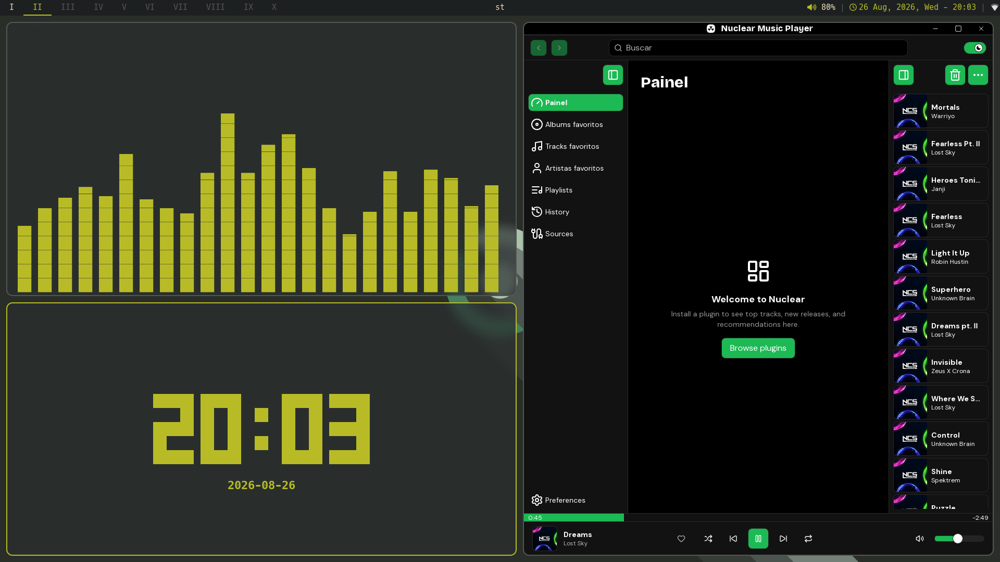
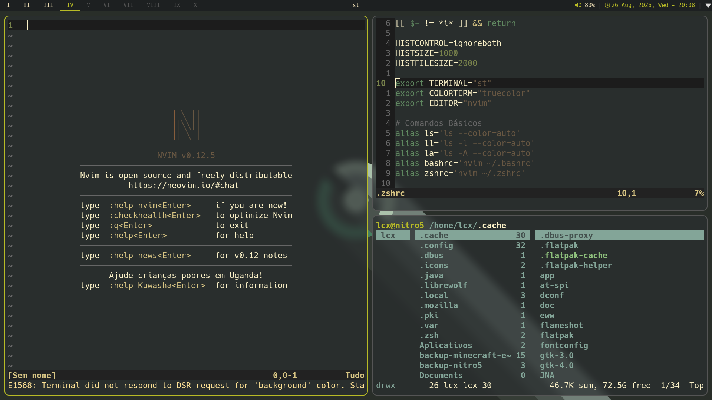

# dotfiles
Welcome at my Void.

## 💻 Configuração
* **Window Manager:** dwm
* **Terminal:** st
* **Shell:** zsh + oh-my-posh (shell prompt para o terminal)
* **Editor:** neovim
* **Launcher / Powermenu:** dmenu
* **Compositor:** picom
* **Barra de Status:** dwmblocks
* **Wallpaper Manager:** feh e nitrogen
* **Informações do Sistema:** fastfetch + btop
* **Explorador de arquivos:** ranger

> "Enter into the Void."

## Screenshots do Sistema (Void Linux + dwm)

