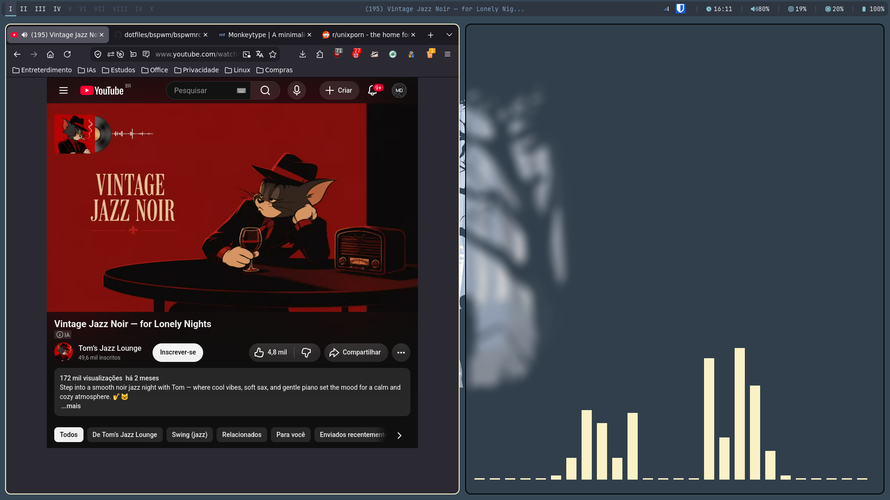
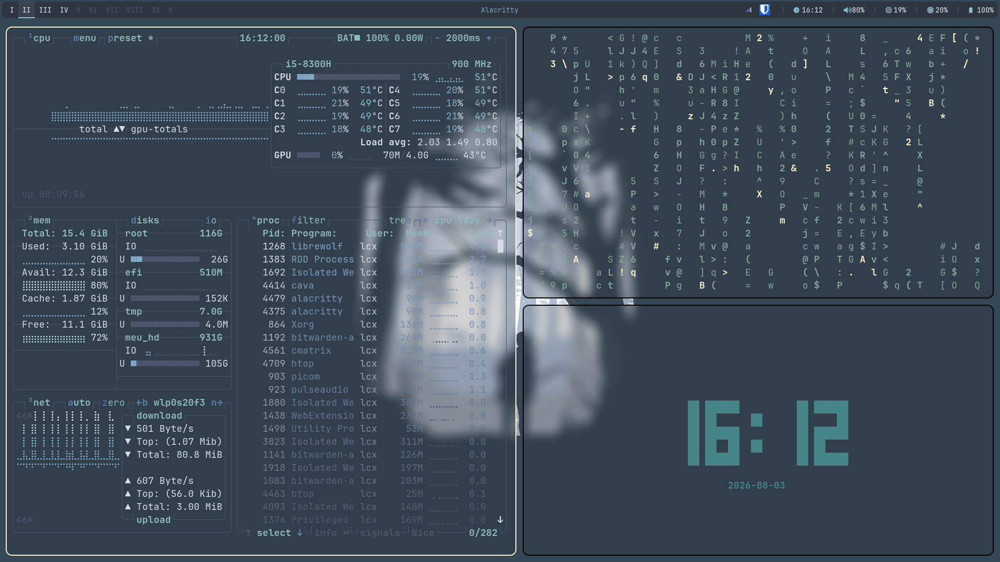
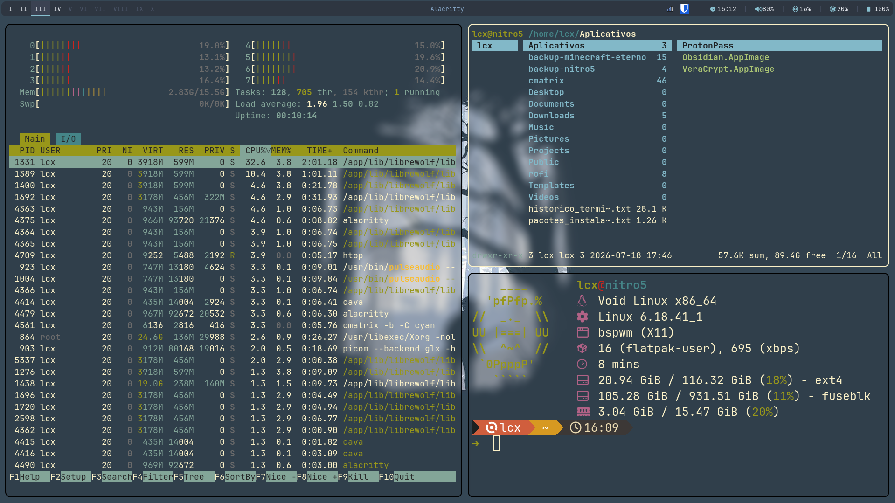
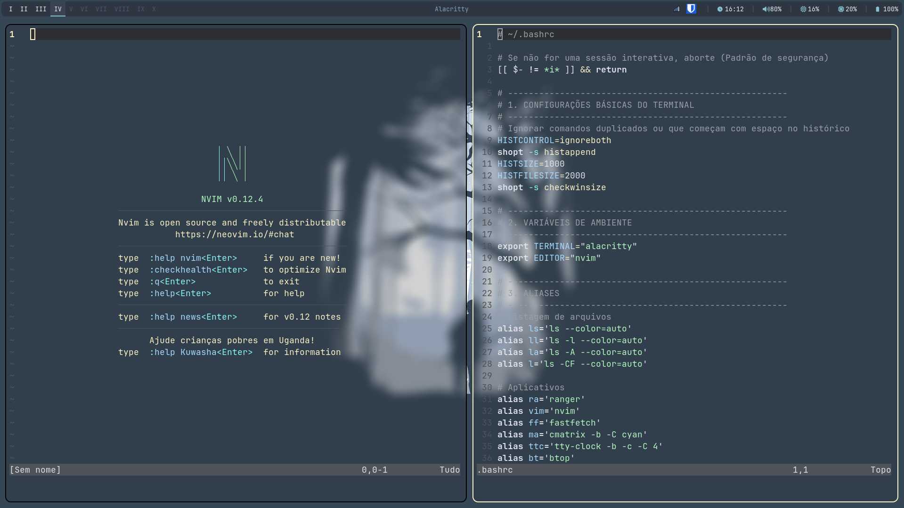

# dotfiles
Welcome at my Void.

## 💻 Core Architecture
* **Window Manager:** i3wm e bspwm
* **Terminal:** Alacritty
* **Shell:** Bash + Oh-My-Posh
* **Editor:** Neovim
* **Launcher / Powermenu:** Rofi
* **Compositor:** Picom

> "Enter into the Void."

## Screenshots do Sistema (Void Linux + bspwm)

